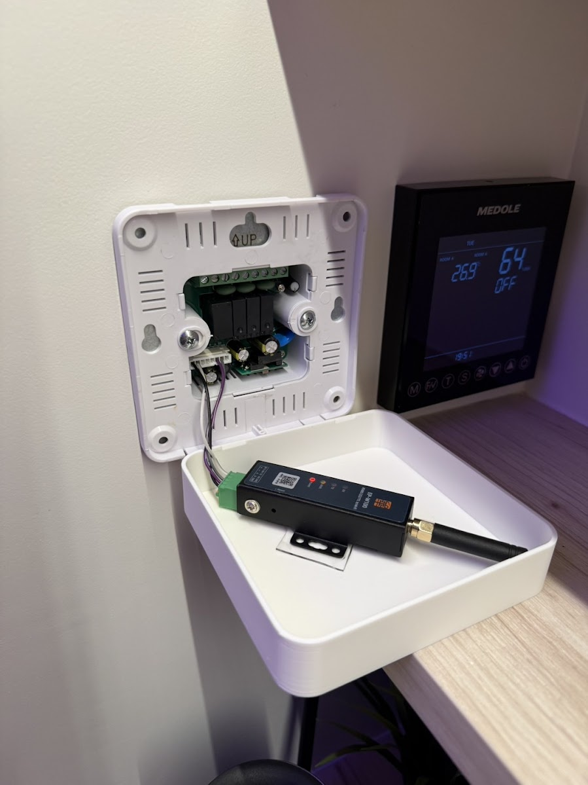
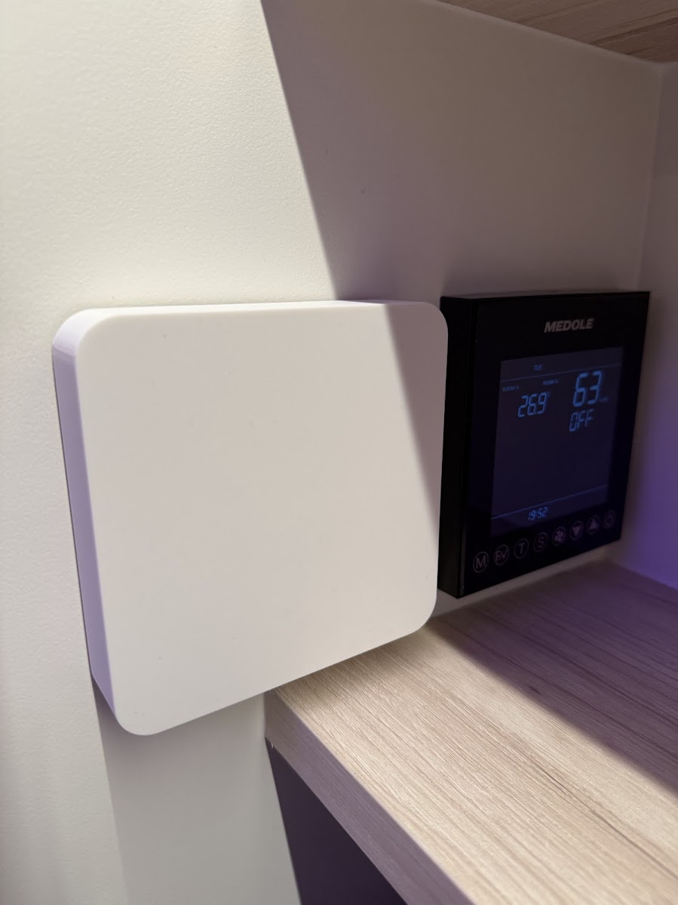

# Delta ERV (台達全熱交換機) Integration for Home Assistant

This is a custom component for Home Assistant that integrates Delta ERV (Energy Recovery Ventilation) devices via Modbus (serial or TCP). You need to connect a RS485 to Ethernet/Wi-Fi converter to the RS485 port of the Delta ERV system.

> **Fork notice.** This repository is a maintenance fork of [aitjcize/ha-delta-erv](https://github.com/aitjcize/ha-delta-erv). See [Changes from upstream](#changes-from-upstream) for what differs.

## Features

- Control ERV fan speed (Low/Medium/High)
- Turn ERV system on/off
- Monitor outdoor and indoor return temperatures
- Monitor supply and exhaust fan speeds
- Monitor system status and error conditions
- Support for both serial RS485 and TCP connections

## Changes from upstream

This fork diverges from [aitjcize/ha-delta-erv](https://github.com/aitjcize/ha-delta-erv) in the following ways. Changes may or may not eventually be contributed back upstream.

- **Non-blocking Modbus connect.** `DeltaERVModbusClient._ensure_connection` used to call `pymodbus`'s blocking `client.connect()` synchronously on the event loop. When the ERV bridge fell off the network, every polling cycle froze Home Assistant for the full TCP timeout (~3 s) and cascaded into MQTT / Supervisor / addon timeouts across the whole instance. The client now dispatches the connect via `hass.async_add_executor_job` and the TCP timeout is lowered from 3 s to 1 s.
- **Single DataUpdateCoordinator.** The 9 entities previously each ran their own 5-second polling loop. A new `DeltaERVDataCoordinator` polls the full register set once per cycle and fans the snapshot out to `CoordinatorEntity` subclasses, so entities also share availability / `UpdateFailed` handling for free. The coordinator tolerates missing optional registers so models like VEB500+ that lack the temperature sensors still work correctly.
- **Pytest test suite.** `tests/` contains a 19-test pytest + pytest-asyncio suite that runs against a live mock Modbus server (`mock-server/`) and covers the modbus client, coordinator, and entity state derivation. Includes a regression test that specifically catches the event-loop-freeze bug above. Runs via `make test`.
- **Mock Modbus server.** `mock-server/` simulates a Delta ERV well enough for local iteration and CI: 12 registers with sensible defaults, an optional simulation thread that derives measured fan RPM from the commanded percentages, and a `simulate=False` mode for deterministic tests.
- **HACS metadata.** `hacs.json` declares a minimum HA version and enables README rendering. `manifest.json` drops the unused `dependencies: ["modbus"]` declaration, bumps `pymodbus` floor to `>=3.11.2`, and points `codeowners` / `documentation` / `issue_tracker` at this fork.
- **CI on Python 3.14.** GitHub Actions workflow runs on Python 3.14 to match the HA 2026.3+ runtime (HA 2026.3.x requires `Python >= 3.14.2`).

## Supported Models

Based on the Delta ERV specification document, this integration supports:
- VEB250-N, VEB150, VEB250, VEB350 models (full feature support)
- VEB500, VEB800, VEB1000 models (limited register support)

**Note:** Some sensors may show as "unavailable" depending on your ERV model. This is normal as different models support different registers. The core fan control functionality (power and speed) is supported on all models.

## Installation

### Hardware
The delta ERV's stock control panel consists of an AC (220V) to DC (5V) transformer, and a screen module with built-in control board. Since we want to control the ERV ourselves, the control board is no longer needed. We can purchase any off-the-self RS485 to wifi converter which can be powered by 5V DC. For example, this [EP-W100 RS485 to Wifi converter](https://e.tb.cn/h.79rbgwYYMP1WPCZ?tk=7FMdUWSXanM) by 华允物联. Connect the pinout from the stock transformer's GND, 5VDC, RS485 A/B pins to the RS845 to wifi converter as shown in the image below.

<p align="center">
  
  
</p>

I've also designed a 3D printable case which matches the original panel design, which can be used to hide the RS485 to wifi converter. You can download the design from this [Makerworld page](https://makerworld.com/en/models/2381915-delta-erv-control-panel-vfru-ervt-03ss-cover)

### Software

#### HACS (recommended)

1. In HACS, open the three-dot menu → *Custom repositories*, paste this repo URL, set category to *Integration*, and add it.
2. Install "Delta ERV" from HACS.
3. Restart Home Assistant.
4. *Settings → Devices & Services → Add Integration → Delta ERV*.

#### Manual

1. Copy the `custom_components/delta_erv` directory to your Home Assistant `/config/custom_components/` directory.
2. Restart Home Assistant.
3. *Settings → Devices & Services → Add Integration → Delta ERV*.

## Configuration

The integration can be configured through the Home Assistant UI. You'll need to provide:

- **Name**: A friendly name for your ERV device
- **Connection Type**: Choose between Serial, TCP, or RTU over TCP
- **For Serial connections**:
  - Port: Serial port (e.g., `/dev/ttyUSB0`)
  - Slave ID: Modbus slave ID (1-247, default: 100/0x64)
  - Optional: Baud rate, data bits, parity, stop bits
- **For TCP connections**:
  - Host: IP address of the Modbus TCP gateway
  - Port: TCP port (default: 502)
  - Slave ID: Modbus slave ID (1-247, default: 100/0x64)

## Entities

### Fan Entity
- **ERV Fan**: Controls the main ERV fan with three speed levels
  - Low (風量 1)
  - Medium (風量 2) 
  - High (風量 3)

### Sensor Entities
- **Outdoor Temperature**: External air temperature
- **Indoor Return Temperature**: Return air temperature
- **Supply Fan Speed**: Supply fan RPM
- **Exhaust Fan Speed**: Exhaust fan RPM
- **Abnormal Status**: System error conditions
- **System Status**: Current system operating state

## Register Mapping

The integration uses the following Modbus registers based on the Delta ERV specification:

| Register | Name | Function |
|----------|------|----------|
| 0x05 | 開關機 | Power On/Off |
| 0x06 | 風量設定 | Fan Speed Setting |
| 0x10 | 異常狀態 | Abnormal Status |
| 0x11 | 外氣溫度 | Outdoor Temperature |
| 0x12 | 室內回風溫度 | Indoor Return Temperature |
| 0x0D | 送風機轉速 | Supply Fan Speed |
| 0x0E | 排風機轉速 | Exhaust Fan Speed |
| 0x13 | 系統狀態 | System Status |

## Hardware Setup

1. Connect your Delta ERV system to a RS485 to Ethernet/Wi-Fi converter
2. Configure the converter for the appropriate baud rate (default: 9600)
3. Set the ERV Modbus slave ID (default: 100)
4. Connect the converter to your network

## Troubleshooting

### Connection Issues
- Verify RS485 wiring (A/B or +/- connections)
- Check baud rate and communication parameters
- Ensure the slave ID matches between the ERV and configuration
- Test with a Modbus testing tool first

### Missing Entities
- Some registers may not be available on all ERV models
- Check the specification document for your specific model
- Enable debug logging to see communication details

### Debug Logging
Add this to your `configuration.yaml` to enable debug logging:

```yaml
logger:
  logs:
    custom_components.delta_erv: debug
```

## Development

Requires Python 3.14 (matching the Home Assistant runtime version this integration targets). Create a virtual environment and install dev dependencies:

```bash
make setup-venv
source .venv/bin/activate
```

Makefile targets:

```bash
# Run linters
make lint

# Run the pytest suite
make test

# Format code
make format

# Check formatting without making changes
make check

# Clean up cache files
make clean
```

This integration is based on the Delta ERV Modbus specification document and follows Home Assistant integration best practices.

## License

This project is licensed under the MIT License.
